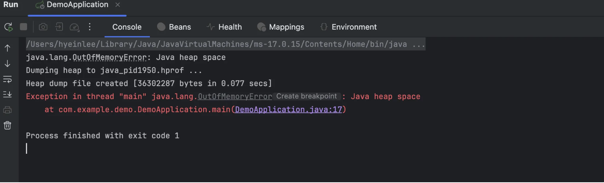
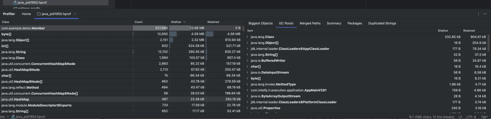

# 2.4 실전:OutOfMemoeryError 예외
각 JVM 의 여러 런타임 메모리 영역에서 발생할 수 있는 예외들이다.

- PC Register: OutOfMemoryError
- Java Virtual Machine Stack
    - StackOverflowError: Thread가 요청한 Stack 깊이라 VM이 허용하는 깊이보다 클 때
    - OutOfMemoryError: Stack 용량을 동적으로 확장하려는 시점에 여유 메모리가 충분하지 않을 때
- Native Method Stacks: StackOverflowError, OutOfMemoryError
- Java Heap: OutOfMemoryError
- Method Area(Runtime Constant Pool 포함): OutOfMemroyError
- Direct Memory: OutOfMermoryError

이번 장의 두 가지 목적

1. jvm 명세에 정의된 각 런타임 영역에 저장되는 내용을 검증한다.
2. 실제 메모리 오버플로가 일어나는 과정을 경험해본다.

jvm 명세에선 예외를 정의할 뿐 OOM 발생 지점은 jvm 벤더마다 다르다고 한다. 

아래 테스트는 jdk17 핫스팟 가상 머신 기준이다.

## 2.4.1 자바 힙 오버플로

자바 힙은 객체 인스턴스가 생성되는 공간이다. 객체를 계속 생성하고 객체들에 대한 접근 정보(참조)가 살아있다면 언젠가는 힙의 최대 용량을 넘을 수 있다.

***실제로 자바 애플리케이션에서 가장 많이 OOM 이 발생하는 영역***

JVM 메모리 크기 옵션을 설정해주어 테스트해본다.

```jsx
// 최소 20mb 최대 20mb, 오버플로우 시점에 힙 메모리의 스냅샷을 남긴다.
-Xms20m -Xmx20m -XX:+HeapDumpOnOutOfMemoryError
```

```java
@SpringBootApplication
public class DemoApplication {

	public static void main(String[] args) {
		// SpringApplication.run(DemoApplication.class, args);
		List<Member> members = new ArrayList<>();

		while(true){
			Member member = new Member("<UNK>"); // 17번 라인에서 OOM 발생
			members.add(member);
		}
	}
}
```




*OOM: Java heap space 확인*

Heap Dump Snapshot 을 확인해본다.



가장 일반적으로 메모리 문제를 해결하는 방법은 메모리 이미지 분석 도구로 힙 덤프 스냅샷을 분석하는 것이다.

오버플로를 일으킨 객체가 꼭 필요한 객체인지, 아닌지를 확인한다.

- 꼭 필요한 객체가 아닌 경우
    - 메모리 누수 (memory leak) 문제이다.
    - 누수된 객체로부터 GC 루트까지의 참조 사슬을 살펴서 어느 GC 루트와 연결되어 있어서 회수를 못하고 있는지 원인을 파악해야 한다.
- 꼭 필요한 객체인 경우
    - 즉, 메모리 누수가 아닌 메모리에 존재하는 모든 객체가 다 살아 있어야 하는 경우이다.
    - jvm 메모리 크기 설정과 컴퓨터의 가용 메모리를 비교하여 jvm 에 더 많이 할당할 수 있는지 확인한다.
    - 코드에서 수명 주기가 너무 길거나 상태를 오래 유지하고 있는 객체가 없는지, 공간 낭비가 심한 데이터 구조는 아닌지를 살펴 보고 런타임에 소비하는 메모리를 최소화하도록 한다.

최적화까지 다 했는데도 OOM 이 발생한다면 그냥 스케일업하거나 이런 방식으로 해야 하지 않을..

## 2.4.2 가상 머신 스택과 네이티브 메소드 스택 오버플로

핫스팟 가상 머신은 가상 머신 스택과 네이티브 메소드 스택을 구분하지 않는다.

따라서, 네이티브 메소드 스택의 크기를 설정하는 -Xoss 매개 변수를 설정해도 효과가 없다. 

스택 크기는 오직 -Xss 매개 변수로만 변경할 수 있다. 

jvm 명세에 정의된 가상 머신 스택과 네이티브 메소드 스택에서의 두 예외이다.

1. 스레드가 요구하는 스택 깊이가 가상 머신이 허용하는 최대 깊이보다 크면 stackoverflow가 발생한다.
2. 가상 머신이 스택 메모리를 동적으로 확장하는 기능을 지원하나, 가용 메모리가 부족해 더 이상 확장이 불가능하다면 OOM 을 발생시킨다.

하지만, 핫스팟 가상 머신은 메모리 동적 확장 기능을 지원하지 않는다. 따라서, 스레드를 생성할 때 메모리가 부족하여 OOM 이 발생하는 것 외에는 스레드 실행 중에 가상 머신 스택의 메모리가 넘치는 일은 없다.

즉, 스택 용량이 부족하여 새로운 스택 프레임을 담을 수 없을 때만 stackoverflow 가 발생한다.

핫스팟 가상 머신을 단일 스레드로 설정해두고 OOM 을 발생시키는지 테스트하자. 

- -Xss 로 스택 메모리 용량을 최소로 줄인 후 stackoverflow 를 유도
    - JVM 스택 메모리 크기를 초과했기 때문
    - 주의할 점: JVM 버전과 OS 에 따라 -Xss 로 설정 가능한 최소 메모리 크기에 제한이 있을 수 있다.
- 한 메소드의 지역 변수를 대량으로 선언하여 스택 프레임의 지역 변수 테이블을 채워 stackoverflow 를 유도
    - 각 스택 프레임의 메모리를 크게 하여 메모리를 다 소진시켰기 때문
    - 핫스팟이 아니라 클래식 JVM 에선 동적으로 메모리를 확장할 수 있으며 이 경우 OOM 을 던진다.

**만약, 단일 스레드로 설정하지 않고 여러 스레드를 계속 만들어서 동작시키면 핫스팟 가상 머신도 OOM 을 던진다.**

하지만, 이 경우는 스택의 메모리 공간과는 관련이 없고 OS 자체의 메모리 상태에 영향을 받는다. 

이는 OS 가 각 프로세스에 할당하는 메모리 크기는 제한적이기 때문이다.

자바 가상 머신 스택과 네이티브 메서드 스택에 할당되는 메모리 크기는 다음과 같다. 

- PC Register의 크기는 매우 작으므로 무시한다.
- OS가 하나의 프로세스에 할당하는 메모리 크기가 32-bits Windows의 경우 최대 2GB 라고 하면,
- 여기서 (매개변수로 설정한 Java Heap과 Method Area 메모리 크기 최댓값)을 빼고
- (Direct Memory와 JVM 프로세스가 자체적으로 소비하는 메모리) 를 제외한 남은 메모리가 할당된다.

따라서, 각 스레드 별로 스택 메모리를 많이 할당하면 생성할 수 있는 스레드 수도 적어진다. 즉, 새로운 스레드를 생성하려 할 때 메모리가 부족하여 OOM 이 발생하는 것이다.

**JVM 은 기본적으로 java 스레드를 OS 의 커널 스레드 (native thread) 와 매핑하여 사용하므로 (가상스레드가 아닌 경우) → 즉, OS 의 자원 상태에 영향을 받을 수 밖에 없다.**

핫스팟 가상 머신에서 OOM 을 발생 시킨 결과이다. ⇒  unable to create native thread

```java
Exception in thread "main" java.lang.OutOfMemoryError: unable to create native thread
```

핫스팟 가상 머신에서 기본 매개 변수로 실행한다면 대부분의 경우 (스택에 추가되는 프레임의 크기는 다 다르겠지만) 스택 깊이가 1000~2000 수준으로 커져도 문제가 없다.

너무 많이 스레드를 만들어 메모리 오버플로가 일어나는 경우, 스레드 수를 줄일 수 없고 64비트 가상 머신을 사용할 수도 없는 상황이라면? 

스레드를 더 많이 만들 수 있는 방법 최대 힙 크기와 스택 용량을 줄이는 방법 뿐이다.

- 최대 힙 크기를 줄인다? → 가상 머신 스택과 네이티브 메소드 스택의 영역이 늘어난다.
- 스택 용량을 줄인다? → 스레드당 사용하는 스택 메모리 크기가 줄어든다. 즉, 동일한 가용 메모리 크기라고 했을 때 스레드 하나가 할당 받는 커널 메모리 크기를 줄이면 더 많은 스레드가 할당받을 수 있다.

## 2.4.3 메소드 영역과 런타임 상수 풀 오버플로

핫스팟 가상 머신은 jdk 8부터 메소드 영역을 영구 세대(permGen) → 메타스페이스로 대체하여 이전과 이후에서 프로그램 영향에 차이가 존재한다.

___

### 런타임 상수 풀

아래 코드를 jdk 버전에 따라 동작시키면서 ***런타임 상수 풀***이 실제 어디 영역에 구현되어 있는지 확인할 수 있다.

```java
/**
 * VM 매개 변수: (JDK 7 이하) -XX:PermSize=6M -XX:MaxPermSize=6M
 * VM 매개 변수: (JDK 8 이상) -XX:MetaspaceSize=6M -XX:MaxMetaspaceSize=6M
 */
public class Main {
    public static void main(String[] args) {
		    // 상수 풀의 참조 유지
        Set<String> set = new HashSet<>();
        short i = 0;

        while (true) {
		    // intern 은 해당 문자열 객체가 상수 풀에 있으면 기존 것을, 없으면 추가하고 참조를 반환한다.
            set.add(String.valueOf(i++).intern());
        }
    }
}
```

- jdk 6에서 실행한 결과
    - OutOfMemoryError: PermGen space 예외가 발생한다.
    - 런타임 상수 풀이 메소드 영역에 있음을 확인할 수 있다.
- jdk 7 이상에서 실행한 결과
    - 아무런 예외를 던지지 않고 무한 루프를 돌며 절대 멈추지 않는다.
    - ***문자열 상수 풀이 자바 힙으로 옮겨졌기 때문이다.***
    - 따라서, 테스트 수행 시 설정한 메소드 영역의 크기 제한이 의미가 없다.

-Xmx6M 으로 자바 힙 최대 크기를 6mb 로 줄여서 테스트 해보면 다음 두 가지에 의해 OOM 을 던진다.

OutOfMemoryError: Java heap space

- 자바 힙에 문자열 객체를 할당하다가
- Set 크기를 확장하다가

문자열 상수 풀의 구현 위치가 달라지면서 다음 코드에서 결과의 변화도 나타난다.

```java
public class Main {
    public static void main(String[] args) {
        String str = new StringBuilder("컴퓨터").append(" 소프트웨어").toString();
        System.out.println(str.intern() == str); // JDK 6에서는 false, JDK 7부터 true
    }
}
```

- jdk 6에선 false 를 반환한다.
    - intern() 은 처음 만나는 문자열 인스턴스를 영구 세대의 문자열 상수 풀에 복사하고, 참조를 반환한다.
    - Stringbuilder 로 생성된 문자열 인스턴스는 자바 힙에 존재하므로 서로의 참조가 다르다!!!
- jdk 7 이상에선 true 를 반환한다.
    - 문자열 상수 풀이 어차피 자바 힙에 구현되어 있다.
    - 따라서 어차피 동일한 문자열의 인스턴스의 참조는 모두 같다.

---

### 메소드 영역의 타입 관련 정보

메소드 영역의 주 역할인 타입 관련 정보 (클래스 이름, 접근 제한자, 상수 풀, 필드 설명, 메소드 설명 등) 을 알아보자. 테스트를 위해 런타임에 메소드 영역이 가득 찰 때까지 클래스를 많이 생성해야 한다.

이때 클래스 생성은 new 로 새로운 클래스 객체 인스턴스를 생성하는 것이 아니라 클래스 정의를 생성해주어야 한다. **CGLib 기술을 사용해 런타임에 바이트 코드를 직접 조작하여 다량의 클래스를 동적으로 생성해주자.**

```java
implementation group: 'cglib', name: 'cglib', version: '3.3.0'
```

```java
/**
 * VM 매개 변수: (JDK 7 이하) -XX:PermSize=6M -XX:MaxPermSize=6M
 * VM 매개 변수: (JDK 8 이상) -XX:MetaspaceSize=6M -XX:MaxMetaspaceSize=6M
 */
public class Main {
    public static void main(String[] args) {
        while (true) {
            Enhancer enhancer = new Enhancer();
            enhancer.setSuperclass(OOMObject.class);
            enhancer.setUseCache(false);
            enhancer.setCallback(new MethodInterceptor() {
                @Override
                public Object intercept(Object o, Method method, Object[] objects, MethodProxy methodProxy) throws Throwable {
                    return methodProxy.invokeSuper(o, objects);
                }
            });
            enhancer.create();
        }
    }

    static class OOMObject {
    }
}
```

- jdk 7에서 실행한 결과
    - OutOfMemoryError thrown from the UncaughtExceptionHandler in thread main
    - 메소드 영역은 영구 세대에 구현됨 → JVM 내 메모리 영역의 일부
    - 영구 세대는 고정 크기로 더 잦은 OOM 유발
- jdk 15에서 실행한 결과
    - ***OutOfMemoryError: Metaspace***
    - 메소드 영역이 메타스페이스로 대체됨 → OS 네이티브 메모리 사용, 동적 크기 확장 가능


>***`CGLib (code generator library)` 은 어디에 사용될까***
>
>스프링과 하이버네이트같은 프레임워크에서 cglib 바이트코드 기술으르 사용해 클래스를 동적으로 강화한다. 
>
> **Spring AOP** 에서 런타임 시 프록시를 생성하는데 인터페이스의 경우 JDK Dynamic Proxy 로, 구현 클래스인 경우 CGLib 을 사용한다. CGLIB를 Spring Boot에서 Default로 사용한다.
> 

jdk 8 버전 이상부턴 Metaspace 로 대체되어 기본 설정으로 실행하였을 때 일반적인 동적 생성 시나리오에선 메소드 영역에서 OOM 을 일으키기가 어렵다. 동적 확장이 되기 때문에.

하지만 파괴적인 동작을 수행하는 것을 방지하기 위해 핫스팟에선 메타스페이스 보호용 매개 변수를 제공한다.

- XX:MaxMetaspaceSize: 메타스페이스 최대 크기. 기본값은 -1 (제한 없음)
- XX:MetaspaceSize: 메타스페이스 초기 크기(바이트 단위). 이 크기가 가득차면 GC가 클래스 언로딩 시도 후 크기를 조정한다. 여유 공간이 많다고 판단하면 크기를 줄이고, 많이 확보하지 못했다면 증가시킨다. 
단, -XX:MaxMetaspaceSize로 최댓값 설정해버렸으면, 그 값을 초과할 수 없다.
- XX:MinMetaspaceFreeRatio: GC 후 가장 작은 메타스페이스 여유 공간 비율(%). 메타스페이스 공간이 부족해 발생하는 GC 빈도를 줄일 수 있다.

## 2.4.4 네이티브 다이렉트 메모리 오버플로

다이렉트 메모리 용량은 -XX:MaxDirectMemorySize 매개변수로 설정하고, 따로 정하지 않았다면 -Xmx로 지정한 자바 힙의 최댓값과 같다.

```java
/**
 * -Xmx20M -XX:MaxDirectMemorySize=10M
 */
public class Main {
    private static final int _1MB = 1024 * 1024;

    public static void main(String[] args) throws Exception {
        Field unsafeField = Unsafe.class.getDeclaredFields()[0];
        unsafeField.setAccessible(true);
        Unsafe unsafe = (Unsafe) unsafeField.get(null);
        while (true) {
            unsafe.allocateMemory(_1MB); // os 메모리를 직접 할당한다.
        }
    }
}
```

NIO 의 DirectByteBuffer 클래스를 건너뛰고 리플렉션을 이용해 Unsafe 인스턴스를 직접 얻어 네이티브 메모리를 할당받고 있는 코드이다.

위 코드를 실행 시 OutOfMemoryError: Unable to allocate 1048576 bytes 결과가 나타난다.